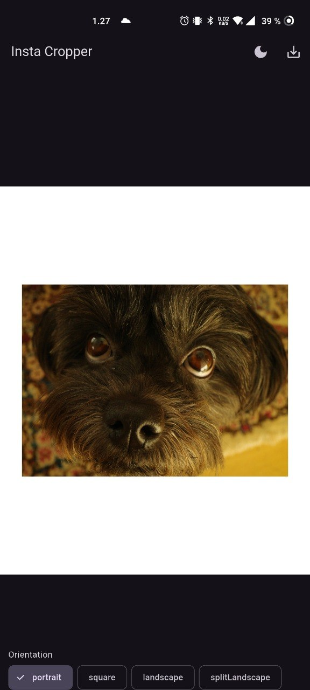
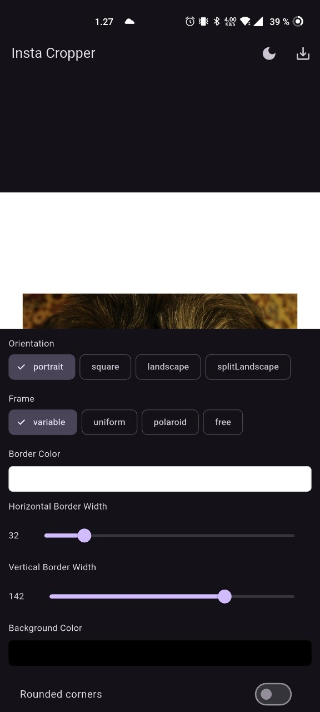
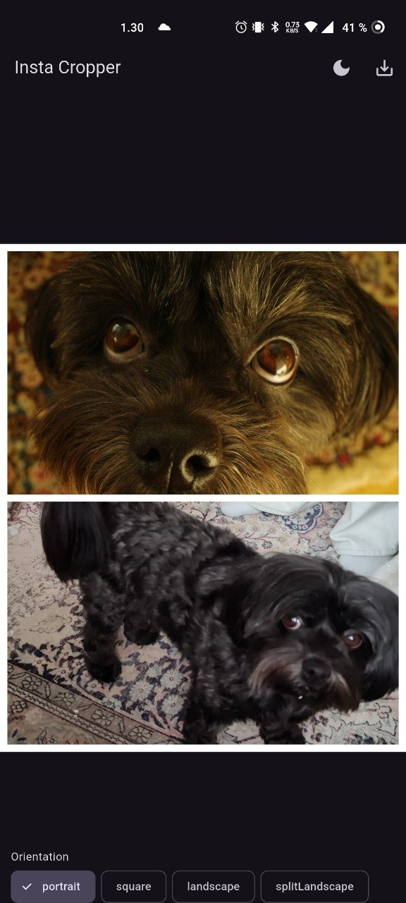

# Fluffy Frames

A cross-platform application for wrapping images intended for publication on Instagram, as well as creating various layout functionalities.

## Why does it exist?

Instagram, despite being a platform intended for photography, doesn't have proper built-in tools for actually publishing said photography. It automatically crops images to a certain resolution, and if the image exceeds the given resolution it compresses it further resulting in a lower-quality end result. Similarly, instagram only supports certain aspect ratios (A fixed portrait, landscape and square) that heavily limit what the user can effectively show.

This is why framing an image within solid color borders is necessary in many situations. Instagram does not provide this functionality within the app and as a result image framing apps like this exist designed specifically for instagram. Fluffy Frames always outputs the image exactly in the maximum resolution supported by instagram regardless of the original file's quality. This leads to an efficient use of resolution and a freedom of scaling and cropping the original image.

## What separates it from other apps?

Various similar apps exist but many are lacking in features and/or lock advanced features behind paywalls, or contain ads. Fluffy Frames is free of charge, open source and ad-free.

Additionally it contains a few features I really wanted for my own publications but couldn't find in other apps on the Play Store, which led me to building this project.

## Which features are/will be supported?

Currently, Fluffy Frames supports all three aspect ratios for Instagram:
- Landscape
- Square
- Portrait

Additionally, the app supports slicing a horizontally oriented image into two separate images to allow for seamless transition within the post view in Instagram. (SplitLandscape)

For each of these, various border styles with the color of the user's choosing are supported:
- Uniform border
- Variable border with separate values for horizontal and vertical thickness
- Polaroid border
- Border-free cropping

Currently, the app is meant for advanced users and as such the process of panning the image to the frame is not automated. Future features include:
- Automated image fitting to frame.
- Saving presets.
- Image rotation.
- Splicing options for more than two images.
- Exporting directly to instagram or other social media.
- Non-instagram output resolutions or aspect ratios for advanced users intended for other applications.
- Advanced options for desktop users.

## Where can I get it?

Currently, the app is still in closed beta testing and as such not ready for wide use. It will be available for executable download on both windows and Android on the Play Store. Web app is also possible in the future. Although flutter does support iOS compiling I currently have no plans for publishing on the App Store due to my personal focus on Android development, but I have no problems with someone else forking this project and publishing it on the App Store as long as it's not monetized.

## Sample photos

